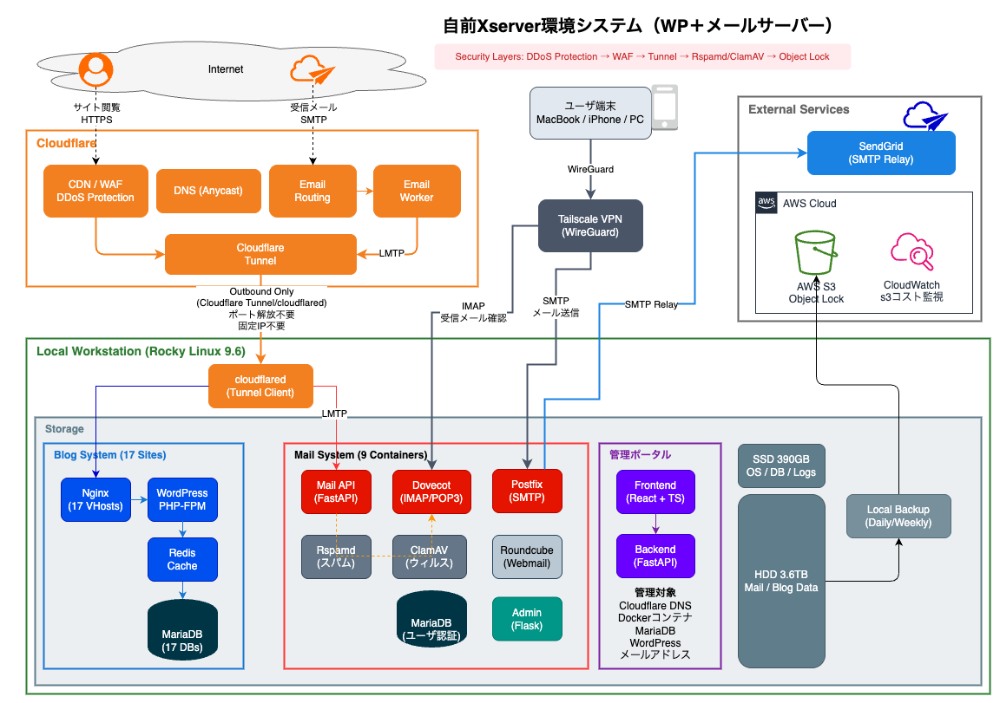

# 自前エックスサーバー環境（WP＋メールサーバ機能）

自宅のワークステーション（Rocky Linux 9.6）で WordPress サイト群とメールサーバーを運用するインフラプロジェクト。

## 概要

オンプレミス環境と Cloudflare/AWS を組み合わせたハイブリッド構成で、メールサーバーと WordPress サイト群を運用しています。管理者ポータル（Web UI）からブラウザ操作で DNS 設定、Docker コンテナ管理、データベース操作などが行えます。

---

## できること

| 機能 | 説明 |
|------|------|
| メール送受信 | IMAP/POP3 (Tailscale経由)、Webmail (Roundcube)、SendGrid経由送信 |
| スパム/ウイルス対策 | Rspamd + ClamAV |
| ユーザー管理 | Web UI でメールアカウント CRUD |
| WordPress 運用 | 17サイト、ドメイン別管理、Redis キャッシュ |
| 自動バックアップ | 日次/週次ローカル + S3 オフサイト |
| 統合管理 | Cloudflare DNS、Docker、DB を単一ポータルから操作 |

---

## アーキテクチャ

### 全体構成図



### メールサーバー

```
┌─────────────────────────────────────────────────────────────────┐
│ 受信フロー (MX)                                                  │
├─────────────────────────────────────────────────────────────────┤
│                                                                 │
│  Internet (Port 25)                                             │
│       │                                                         │
│       ▼                                                         │
│  Cloudflare Email Routing ─── MXレコードの受け口                 │
│       │                                                         │
│       ▼                                                         │
│  Email Worker (JavaScript) ─── メール解析・転送処理              │
│       │                                                         │
│       ▼                                                         │
│  Cloudflare Tunnel (暗号化通信)                                  │
│       │                                                         │
│       ▼                                                         │
│  ┌─────────────────────────────────────────────────────────┐   │
│  │ 自宅ワークステーション                                    │   │
│  │                                                         │   │
│  │  Mail API (FastAPI) ← Worker からの受信                  │   │
│  │       │                                                 │   │
│  │       ▼                                                 │   │
│  │  Dovecot (LMTP) → メールボックス保存                     │   │
│  │                                                         │   │
│  └─────────────────────────────────────────────────────────┘   │
│                                                                 │
└─────────────────────────────────────────────────────────────────┘

┌─────────────────────────────────────────────────────────────────┐
│ クライアントアクセス (IMAP/POP3)                                 │
├─────────────────────────────────────────────────────────────────┤
│                                                                 │
│  Tailscale VPN (登録端末のみ)                                    │
│       │                                                         │
│       ▼                                                         │
│  ┌─────────────────────────────────────────────────────────┐   │
│  │ 自宅ワークステーション                                    │   │
│  │                                                         │   │
│  │  Dovecot (IMAP/POP3) ← Tailscale 経由のみ接続可能        │   │
│  │       │                                                 │   │
│  │       ▼                                                 │   │
│  │  MariaDB (ユーザー認証)                                  │   │
│  │                                                         │   │
│  │  [その他コンポーネント]                                   │   │
│  │  ├─ Roundcube (Webmail) ← Tunnel 経由で公開              │   │
│  │  ├─ ClamAV (ウイルススキャン)                            │   │
│  │  ├─ Rspamd (スパムフィルタ)                              │   │
│  │  └─ User Management (Flask)                             │   │
│  └─────────────────────────────────────────────────────────┘   │
│                                                                 │
└─────────────────────────────────────────────────────────────────┘

┌─────────────────────────────────────────────────────────────────┐
│ 送信フロー                                                       │
├─────────────────────────────────────────────────────────────────┤
│                                                                 │
│  Mail Client (Thunderbird, iPhone 等)                           │
│       │ ※ Tailscale VPN 経由で接続                              │
│       ▼                                                         │
│  Postfix (SMTP認証)                                             │
│       │                                                         │
│       ▼                                                         │
│  SendGrid Relay ─── 高配信率・SPF/DKIM署名                       │
│       │                                                         │
│       ▼                                                         │
│  Internet (宛先メールサーバー)                                    │
│                                                                 │
└─────────────────────────────────────────────────────────────────┘
```

**構成**: 9コンテナ（Postfix, Dovecot, MariaDB, Roundcube, ClamAV, Rspamd, Mail API, User Management, Cloudflared）

### ブログ

```
┌─────────────────────────────────────────────────────────────────┐
│ Web アクセスフロー                                               │
├─────────────────────────────────────────────────────────────────┤
│                                                                 │
│  Internet (HTTPS)                                               │
│       │                                                         │
│       ▼                                                         │
│  Cloudflare                                                     │
│  ├─ SSL/TLS 終端                                                │
│  ├─ DDoS Protection                                             │
│  ├─ CDN キャッシュ                                               │
│  └─ WAF                                                         │
│       │                                                         │
│       ▼                                                         │
│  Cloudflare Tunnel (暗号化通信・ポート開放不要)                   │
│       │                                                         │
│       ▼                                                         │
│  ┌─────────────────────────────────────────────────────────┐   │
│  │ 自宅ワークステーション                                    │   │
│  │                                                         │   │
│  │  cloudflared (Tunnel クライアント)                       │   │
│  │       │                                                 │   │
│  │       ▼                                                 │   │
│  │  Nginx (17 Virtual Hosts)                               │   │
│  │       │                                                 │   │
│  │       ▼                                                 │   │
│  │  WordPress (PHP-FPM) ─── 17サイト運用                    │   │
│  │       │                                                 │   │
│  │       ├──▶ MariaDB (17 databases)                       │   │
│  │       │                                                 │   │
│  │       └──▶ Redis (Object Cache) ─── 高速化              │   │
│  │                                                         │   │
│  └─────────────────────────────────────────────────────────┘   │
│                                                                 │
└─────────────────────────────────────────────────────────────────┘
```

**構成**: 5コンテナ（Nginx, WordPress/PHP-FPM, MariaDB, Redis, Cloudflared）で17サイト運用

### 管理者ポータル

ブラウザから各種管理操作を行うための統合管理ポータル（FastAPI + React）を提供しています。

```
┌─────────────────────────────────────────────────────────────────┐
│ 管理者ポータル                                                    │
├─────────────────────────────────────────────────────────────────┤
│                                                                 │
│  ブラウザ (管理者)                                                │
│       │                                                         │
│       ▼                                                         │
│  ┌─────────────────────────────────────────────────────────┐   │
│  │ 自宅ワークステーション                                    │   │
│  │                                                         │   │
│  │  Frontend (React + TypeScript)                          │   │
│  │       │                                                 │   │
│  │       ▼                                                 │   │
│  │  Backend (FastAPI)                                      │   │
│  │       │                                                 │   │
│  │       ├──▶ Cloudflare API (DNS管理)                     │   │
│  │       ├──▶ Docker API (コンテナ管理)                     │   │
│  │       ├──▶ MariaDB (データベース操作)                    │   │
│  │       └──▶ WordPress (サイト管理)                        │   │
│  │                                                         │   │
│  └─────────────────────────────────────────────────────────┘   │
│                                                                 │
└─────────────────────────────────────────────────────────────────┘
```

**構成**: 2コンテナ（Backend: FastAPI, Frontend: React）

**実装済み機能**:

| 機能 | 説明 |
|------|------|
| **DNS管理** | Cloudflare DNS レコードの一覧表示・作成・編集・削除、プロキシ設定 |
| **Dockerコンテナ管理** | コンテナ一覧、起動・停止・再起動、ログ表示 |
| **データベース管理** | MariaDB データベース・テーブル一覧、クエリ実行 |
| **WordPress管理** | サイト一覧、プラグイン・テーマ管理、キャッシュクリア |
| **PHP設定** | PHP.ini 設定の確認・変更 |
| **セキュリティ** | SSL証明書状況、WAF設定、アクセスログ |
| **バックアップ** | バックアップ履歴、手動バックアップ実行、S3同期状況 |

### バックアップ

```
┌─────────────────────────────────────────────────────────────────┐
│ バックアップフロー                                               │
├─────────────────────────────────────────────────────────────────┤
│                                                                 │
│  自宅ワークステーション                                          │
│  ├─ SSD 390GB (OS, DB, Logs)                                    │
│  └─ HDD 3.6TB (Mail, Blog データ)                               │
│            │                                                    │
│            │ 日次/週次 自動バックアップ (cron)                   │
│            ▼                                                    │
│       ローカルバックアップ領域                                   │
│            │                                                    │
│            │ S3 同期 (暗号化転送)                                │
│            ▼                                                    │
│       AWS S3                                                    │
│       ├─ Object Lock (COMPLIANCE)                               │
│       │   └─ ランサムウェア対策: 削除・変更不可                  │
│       └─ CloudWatch                                             │
│           └─ コスト監視アラート                                  │
│                                                                 │
└─────────────────────────────────────────────────────────────────┘
```

---

## ネットワーク

自宅サーバーでメール・Webサービスを運用する際には、以下のような課題があります。

- **ポート25ブロック**: 多くの ISP が迷惑メール対策でポート25を遮断
- **動的IP**: 固定IPがないとDNS設定が困難
- **セキュリティ**: ポート開放は攻撃対象になりやすい
- **証明書管理**: SSL証明書の取得・更新が面倒

これらを Cloudflare と Tailscale を組み合わせて解決しています。

### Cloudflare

Cloudflare の無料プランを最大限に活用し、エンタープライズ級のネットワーク機能を実現しています。

#### 利用機能一覧

| 機能 | 用途 | 本システムでの活用 |
|------|------|-------------------|
| **Tunnel** | セキュア公開 | WordPress 17サイト + Webmail を公開、ポート開放不要 |
| **Email Routing** | MX受信 | ポート25なしでメール受信、Worker へ転送 |
| **Email Worker** | メール処理 | JavaScript でメール解析、LMTP への中継処理 |
| **CDN** | 高速配信 | 静的コンテンツのキャッシュ、画像最適化 |
| **SSL/TLS** | 証明書管理 | 自動発行・更新、HTTPS 強制（Let's Encrypt 不要） |
| **WAF** | 攻撃防御 | OWASP ルール、SQLi/XSS 対策 |
| **DDoS Protection** | 大規模攻撃対策 | L3/L4/L7 すべてのレイヤーで防御 |
| **DNS** | 名前解決 | Anycast DNS、高速・高可用性 |
| **API** | プログラム制御 | 管理ポータルから DNS レコード操作 |

#### Cloudflare Tunnel 構成

```
┌─────────────────────────────────────────────────────────────────┐
│ Cloudflare Tunnel                                               │
├─────────────────────────────────────────────────────────────────┤
│                                                                 │
│  インターネット                                                   │
│       │                                                         │
│       ▼                                                         │
│  Cloudflare Edge (Anycast)                                      │
│  ├─ SSL 終端                                                    │
│  ├─ WAF / DDoS Protection                                       │
│  └─ CDN キャッシュ                                               │
│       │                                                         │
│       │ ※ Outbound 接続のみ（Inbound ポート開放不要）            │
│       ▼                                                         │
│  ┌─────────────────────────────────────────────────────────┐   │
│  │ 自宅ワークステーション                                    │   │
│  │                                                         │   │
│  │  cloudflared (Tunnel クライアント)                       │   │
│  │       │                                                 │   │
│  │       ├──▶ Nginx (WordPress 17サイト)                   │   │
│  │       ├──▶ Nginx (Roundcube Webmail)                    │   │
│  │       └──▶ FastAPI (Mail API)                           │   │
│  │                                                         │   │
│  └─────────────────────────────────────────────────────────┘   │
│                                                                 │
│  ✅ ファイアウォールでポート開放不要                             │
│  ✅ 動的IP でも自動追従                                         │
│  ✅ 固定IPアドレス契約不要                                       │
│                                                                 │
└─────────────────────────────────────────────────────────────────┘
```

#### API 連携（管理ポータル統合）

管理ポータルから Cloudflare API を呼び出し、DNS レコードをブラウザ操作で管理できます。

```
┌─────────────────────────────────────────────────────────────────┐
│ Cloudflare API 連携                                             │
├─────────────────────────────────────────────────────────────────┤
│                                                                 │
│  管理ポータル (React)                                            │
│       │                                                         │
│       ▼                                                         │
│  Backend (FastAPI)                                              │
│       │                                                         │
│       │ API Token (Zone:DNS:Edit 権限)                          │
│       ▼                                                         │
│  Cloudflare API (api.cloudflare.com)                            │
│       │                                                         │
│       ├─ GET  /zones/{zone_id}/dns_records     → レコード一覧   │
│       ├─ POST /zones/{zone_id}/dns_records     → レコード作成   │
│       ├─ PUT  /zones/{zone_id}/dns_records/{id} → レコード更新  │
│       └─ DELETE /zones/{zone_id}/dns_records/{id} → レコード削除│
│                                                                 │
└─────────────────────────────────────────────────────────────────┘

実装例:
├─ A/AAAA/CNAME レコードの CRUD
├─ MX レコード管理（優先度設定）
├─ TXT レコード（SPF/DKIM/DMARC）
├─ プロキシ設定（オレンジクラウド ON/OFF）
└─ TTL 設定
```

### Tailscale

WireGuard ベースの VPN で、メールクライアントアクセスをゼロトラストモデルで保護しています。

#### 利用シーン

| 用途 | 説明 |
|------|------|
| **IMAP/POP3 アクセス** | メールクライアント（Thunderbird, iPhone 等）からの接続 |
| **SMTP 送信** | メール送信時の認証接続 |
| **管理者アクセス** | SSH、管理ポータルへの接続（オプション） |

#### アクセス制御モデル

```
┌─────────────────────────────────────────────────────────────────┐
│ Tailscale ネットワーク                                           │
├─────────────────────────────────────────────────────────────────┤
│                                                                 │
│  登録デバイス                                                    │
│  ├─ MacBook (100.x.x.1)                                         │
│  ├─ iPhone (100.x.x.2)                                          │
│  └─ Windows PC (100.x.x.3)                                      │
│       │                                                         │
│       │ WireGuard 暗号化トンネル                                 │
│       ▼                                                         │
│  ┌─────────────────────────────────────────────────────────┐   │
│  │ 自宅ワークステーション (100.x.x.10)                       │   │
│  │                                                         │   │
│  │  Dovecot                                                │   │
│  │  ├─ IMAP (TLS)  ← Tailscale 経由のみ                    │   │
│  │  └─ POP3 (TLS)  ← Tailscale 経由のみ                    │   │
│  │                                                         │   │
│  │  Postfix                                                │   │
│  │  └─ SMTP (STARTTLS) ← Tailscale 経由のみ                │   │
│  │                                                         │   │
│  └─────────────────────────────────────────────────────────┘   │
│                                                                 │
│  ✅ 公開インターネットからは IMAP/SMTP ポート到達不可            │
│  ✅ Tailscale 登録デバイスのみ接続可能                           │
│  ✅ デバイス追加/削除は Tailscale 管理画面で即時反映             │
│                                                                 │
└─────────────────────────────────────────────────────────────────┘
```

#### セキュリティ特性

| 項目 | 説明 |
|------|------|
| **暗号化** | WireGuard（ChaCha20-Poly1305） |
| **認証** | デバイス証明書 + アカウント認証 |
| **NAT トラバーサル** | DERP リレー経由で NAT 越え |
| **ゼロトラスト** | 登録デバイスのみ、ネットワーク境界に依存しない |

### 統合活用

Cloudflare と Tailscale を組み合わせることで、自宅サーバーの課題を解決しています。

#### 課題と解決策

| 課題 | 解決策 | 担当 |
|------|--------|------|
| ISPによるポート25ブロック | Email Routing + Worker でMX受信 | Cloudflare |
| 固定IPがない | Tunnel で動的IPでも安定公開 | Cloudflare |
| ポート開放のセキュリティリスク | Outbound 接続のみで公開 | Cloudflare |
| メールサーバーへの不正アクセス | VPN 登録端末のみ接続可能 | Tailscale |
| SSL証明書の管理 | 自動発行・更新 | Cloudflare |
| DDoS攻撃 | Edge で防御、オリジンに到達しない | Cloudflare |

#### 通信経路の全体像

```
┌─────────────────────────────────────────────────────────────────┐
│ 通信経路サマリー                                                 │
├─────────────────────────────────────────────────────────────────┤
│                                                                 │
│  [公開インターネット]                                            │
│       │                                                         │
│       ├── HTTPS (WordPress/Webmail)                             │
│       │      └──▶ Cloudflare Edge → Tunnel → Nginx             │
│       │                                                         │
│       ├── MX (メール受信)                                        │
│       │      └──▶ Cloudflare Email → Worker → Tunnel → API     │
│       │                                                         │
│       └── IMAP/POP3/SMTP                                        │
│              └──▶ ❌ ブロック（公開ポートなし）                  │
│                                                                 │
│  [Tailscale ネットワーク]                                        │
│       │                                                         │
│       └── IMAP/POP3/SMTP (メールクライアント)                    │
│              └──▶ ✅ WireGuard → Dovecot/Postfix                │
│                                                                 │
└─────────────────────────────────────────────────────────────────┘

結果:
├─ ファイアウォールでのポート開放: 0個
├─ 公開サービス: Cloudflare 経由で安全に公開
├─ 非公開サービス: Tailscale で登録デバイスのみ
└─ 固定IP契約: 不要
```

---

## セキュリティ

### 多層防御アーキテクチャ（Defense in Depth）

外部からの攻撃に対して複数のセキュリティレイヤーで保護しています。

```
┌─────────────────────────────────────────────────────────────────┐
│ セキュリティレイヤー                                              │
├─────────────────────────────────────────────────────────────────┤
│                                                                 │
│  Layer 1: エッジ防御 (Cloudflare)                                │
│  ├─ DDoS Protection (L3/L4/L7)                                  │
│  ├─ WAF (OWASP Top 10 対策)                                     │
│  ├─ Bot Management                                              │
│  └─ Rate Limiting                                               │
│                                                                 │
│  Layer 2: ネットワーク分離                                       │
│  ├─ Cloudflare Tunnel (ポート開放不要)                          │
│  ├─ Tailscale VPN (IMAP/POP3 アクセス制限)                      │
│  └─ Docker Network Isolation                                    │
│                                                                 │
│  Layer 3: アプリケーション防御                                   │
│  ├─ Rspamd (スパムフィルタ、スコアリング)                        │
│  ├─ ClamAV (ウイルス/マルウェアスキャン)                         │
│  └─ Fail2ban (ブルートフォース対策)                              │
│                                                                 │
│  Layer 4: データ保護                                             │
│  ├─ S3 Object Lock COMPLIANCE (ランサムウェア対策)               │
│  ├─ 暗号化転送 (TLS 1.3)                                        │
│  └─ バックアップ世代管理                                         │
│                                                                 │
└─────────────────────────────────────────────────────────────────┘
```

### メール認証（送信ドメイン認証）

なりすましメール防止のため、3つの認証技術を実装しています。

| 技術 | 役割 | 実装内容 |
|------|------|----------|
| **SPF** | 送信サーバー認証 | SendGrid の IP アドレスを許可リストに登録 |
| **DKIM** | メール署名 | 2048bit RSA 鍵でメール本文・ヘッダーに署名 |
| **DMARC** | ポリシー制御 | `p=quarantine` で認証失敗メールを隔離、レポート受信 |

```
送信メールの認証フロー:

Postfix → SendGrid (DKIM署名) → 受信サーバー
                                    │
                                    ├─ SPF検証: SendGrid IP が許可済みか
                                    ├─ DKIM検証: 署名が有効か
                                    └─ DMARC検証: ポリシーに準拠しているか
```

### アクセス制御

| 対象 | 制御方式 | 詳細 |
|------|----------|------|
| **Web (WordPress)** | Cloudflare Tunnel | 公開（WAF/DDoS Protection 経由） |
| **Webmail (Roundcube)** | Cloudflare Tunnel | 公開（Cloudflare Access で制限可能） |
| **IMAP/POP3** | Tailscale VPN | 登録デバイスのみ（ゼロトラストモデル） |
| **SMTP (送信)** | Tailscale VPN | 登録デバイスのみ |
| **管理ポータル** | ローカル/VPN | 内部ネットワークのみ |
| **SSH** | 公開鍵認証のみ | パスワード認証無効、root 禁止 |

### マルウェア対策（3層防御）

```
受信メール → Rspamd (スパムスコアリング)
                │
                ▼
         ClamAV (ウイルススキャン)
                │
                ▼
         Dovecot (メールボックス保存)

定期スキャン:
├─ ClamAV: 日次フルスキャン (AM 5:00)
├─ rkhunter: ルートキット検出 (週次)
└─ 定義ファイル: 自動更新 (4時間毎)
```

### ランサムウェア対策

AWS S3 の Object Lock (COMPLIANCE モード) を使用し、バックアップデータの改ざん・削除を防止。

| 設定 | 値 | 効果 |
|------|-----|------|
| **Retention Period** | 30日 | 30日間は誰も削除不可（root/AWS管理者含む） |
| **Legal Hold** | 無効 | 訴訟ホールドは未使用 |
| **Versioning** | 有効 | 全バージョン保持 |

```
攻撃シナリオと防御:

1. ローカルデータ暗号化攻撃
   → S3 の Object Lock データから復旧可能

2. S3 データ削除試行
   → COMPLIANCE モードで削除不可（API/Console 両方）

3. AWS 認証情報漏洩
   → Object Lock は root でも解除不可
```

### 認証情報管理

| 項目 | 管理方法 |
|------|----------|
| **API キー** | 環境変数 (.env)、Git 管理外 |
| **データベース認証** | Docker Secrets / 環境変数 |
| **AWS 認証** | IAM ロール + 最小権限ポリシー |
| **SSH 鍵** | Ed25519、パスフレーズ付き |
| **Cloudflare API** | API Token（ゾーン限定権限） |

### コンプライアンス対応

| 観点 | 対応状況 |
|------|----------|
| **通信暗号化** | TLS 1.3（Cloudflare 終端）、内部通信も TLS |
| **保存データ暗号化** | S3 Server-Side Encryption (SSE-S3) |
| **アクセスログ** | Nginx/Postfix/Dovecot ログ保持（90日） |
| **監査証跡** | CloudWatch Logs、S3 アクセスログ |

---

## ディレクトリ構成

```
project-root-infra/
├── docs/
│   ├── infra/                    # インフラ構築手順
│   └── application/
│       ├── mailserver/           # Mailserver 設計・運用
│       ├── blog/                 # Blog System 設計・運用
│       └── unified-portal/       # 統合ポータル設計
├── services/
│   ├── mailserver/               # Mailserver 実装
│   │   ├── docker-compose.yml
│   │   ├── config/               # Postfix, Dovecot 等の設定
│   │   ├── scripts/              # バックアップ、リストア
│   │   ├── terraform/            # AWS IaC
│   │   └── usermgmt/             # Flask ユーザー管理
│   ├── blog/                     # Blog System 実装
│   │   ├── docker-compose.yml
│   │   ├── config/               # Nginx, WordPress 設定
│   │   └── scripts/              # サイト作成、SMTP設定
│   └── unified-portal/           # 統合ポータル実装
│       ├── backend/              # FastAPI
│       └── frontend/             # React + TypeScript
└── README.md
```

---

## クイックスタート

### 前提条件

- Rocky Linux 9.x（他の RHEL 系でも可）
- Docker & Docker Compose
- Cloudflare アカウント（無料プラン可）
- Tailscale アカウント（無料プラン可）
- ストレージ: システム用 100GB 程度 + データ量に応じた容量

### Mailserver 起動

```bash
cd services/mailserver
cp .env.example .env  # 環境変数を設定
docker compose up -d
```

### Blog System 起動

```bash
cd services/blog
cp .env.example .env
docker compose up -d
```

### Unified Portal 起動

```bash
cd services/unified-portal
cp .env.example .env
docker compose up -d
```

---

## 運用コマンド

### 状態確認

```bash
# Mailserver
cd services/mailserver && docker compose ps

# Blog
cd services/blog && docker compose ps

# ログ確認
docker compose logs -f postfix
docker compose logs -f wordpress
```

### バックアップ

```bash
cd services/mailserver/scripts

# ローカルバックアップ
./backup-mailserver.sh --daily

# S3アップロード
./backup-to-s3.sh

# マルウェアスキャン
./scan-mailserver.sh --daily
```

### リストア

```bash
cd services/mailserver/scripts

# プレビュー
./restore-mailserver.sh --from /mnt/backup-hdd/mailserver/daily/YYYY-MM-DD --dry-run

# 実行
./restore-mailserver.sh --from /mnt/backup-hdd/mailserver/daily/YYYY-MM-DD --component all
```

---

## 技術スタック

| カテゴリ | 技術 |
|---------|------|
| OS | Rocky Linux 9.6 |
| コンテナ | Docker, Docker Compose |
| Mail | Postfix, Dovecot, Roundcube |
| Web | Nginx, WordPress, PHP-FPM |
| DB | MariaDB |
| Cache | Redis |
| IaC | Terraform |
| Cloud | Cloudflare (Tunnel, Email Worker), AWS (S3, CloudWatch) |
| VPN | Tailscale (WireGuard ベース) |
| Backend | FastAPI, Flask |
| Frontend | React, TypeScript, Tailwind CSS |
| AI | Claude Code |

---

## ハードウェア構成

自宅ワークステーションのスペック:

| リソース | スペック | 用途 |
|---------|---------|------|
| CPU | 6コア / 12スレッド | Docker コンテナ実行 |
| RAM | 32GB | 現在 15GB 程度使用 |
| SSD | 390GB | OS、DB、ログ |
| HDD (内蔵) | 3.6TB | メールデータ、WordPress、バックアップ |

※ 現在はリソースに余裕があり、フル稼働ではありません

---

## ランニングコスト

| サービス | 月額 |
|---------|------|
| Cloudflare (Tunnel, Email Worker, DNS) | 無料 |
| Tailscale | 無料 |
| AWS S3 + CloudWatch | 約 150円 |
| SendGrid | 無料枠 |
| **合計** | **約 150円/月** |

※ 当初は EC2 で MX Gateway を運用していましたが、Cloudflare Email Worker に移行して月額 525円 削減しました。

---

## ドキュメント

- [インフラ構築](docs/infra/README.md)
- [メールサーバー](docs/application/mailserver/README.md)
- [ブログシステム](docs/application/blog/README.md)
- [統合管理ポータル](docs/application/unified-portal/README.md)

---

## 作成者

**Naoya Iimura**

ネットワークセールスエンジニア / 個人開発エンジニア / ウェブマーケター

📜 CCNA / LPIC-1, 2, 303 Security / AWS SAA

📧 info@kuma8088.com
