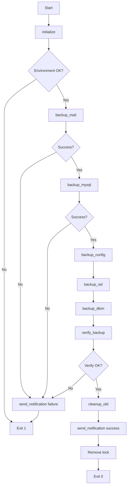

# メールサーバーバックアップシステム設計書

**作成日**: 2025-11-07
**バージョン**: 1.0
**対象システム**: Dell Mailserver (Docker Compose 環境)
**前提ドキュメント**: [01_requirements.md](./01_requirements.md)

---

## 📋 目次

1. [システムアーキテクチャ](#1-システムアーキテクチャ)
2. [バックアップスクリプト設計](#2-バックアップスクリプト設計)
3. [ディレクトリ構造設計](#3-ディレクトリ構造設計)
4. [データフロー設計](#4-データフロー設計)
5. [エラーハンドリング設計](#5-エラーハンドリング設計)
6. [通知メカニズム設計](#6-通知メカニズム設計)
7. [ログ設計](#7-ログ設計)
8. [設定ファイル設計](#8-設定ファイル設計)
9. [リカバリー設計](#9-リカバリー設計)
10. [テスト設計](#10-テスト設計)

---

## 1. システムアーキテクチャ

### 1.1 全体構成図

```
┌─────────────────────────────────────────────────────────────┐
│                    Dell Mailserver                          │
│  ┌────────────────────────────────────────────────────────┐ │
│  │  Docker Compose Environment                            │ │
│  │  ┌──────────┐ ┌──────────┐ ┌──────────┐ ┌──────────┐ │ │
│  │  │ Postfix  │ │ Dovecot  │ │  MySQL   │ │Roundcube │ │ │
│  │  └──────────┘ └──────────┘ └──────────┘ └──────────┘ │ │
│  └────────────────────────────────────────────────────────┘ │
│                           │                                  │
│                           │ data volumes                     │
│                           ▼                                  │
│  ┌────────────────────────────────────────────────────────┐ │
│  │  /opt/onprem-infra-system/project-root-infra/          │ │
│  │  services/mailserver/                                  │ │
│  │  ├── data/mail/        (メールデータ)                  │ │
│  │  ├── data/mysql/       (MySQLデータ)                   │ │
│  │  ├── data/certbot/     (SSL証明書)                     │ │
│  │  ├── config/           (設定ファイル)                  │ │
│  │  └── logs/             (ログファイル)                  │ │
│  └────────────────────────────────────────────────────────┘ │
│                           │                                  │
│                           │ backup script                    │
│                           ▼                                  │
│  ┌────────────────────────────────────────────────────────┐ │
│  │  /opt/onprem-infra-system/project-root-infra/          │ │
│  │  services/mailserver/scripts/                          │ │
│  │  └── backup-mailserver.sh                              │ │
│  │      ├── backup_mail()      (rsync)                    │ │
│  │      ├── backup_mysql()     (mysqldump)                │ │
│  │      ├── backup_config()    (tar)                      │ │
│  │      ├── backup_ssl()       (tar)                      │ │
│  │      └── cleanup_old()      (find + rm)                │ │
│  └────────────────────────────────────────────────────────┘ │
│                           │                                  │
│                           │ rsync / mysqldump                │
│                           ▼                                  │
└─────────────────────────────────────────────────────────────┘
                            │
                            ▼
┌─────────────────────────────────────────────────────────────┐
│              External HDD (/mnt/backup-hdd)                 │
│  ┌────────────────────────────────────────────────────────┐ │
│  │  /mnt/backup-hdd/mailserver/                           │ │
│  │  ├── daily/                                            │ │
│  │  │   ├── 2025-11-07/                                   │ │
│  │  │   │   ├── mail/                                     │ │
│  │  │   │   ├── mysql/                                    │ │
│  │  │   │   ├── config/                                   │ │
│  │  │   │   ├── ssl/                                      │ │
│  │  │   │   └── backup.log                                │ │
│  │  │   └── 2025-11-08/                                   │ │
│  │  ├── weekly/                                           │ │
│  │  │   ├── 2025-week-45/                                 │ │
│  │  │   └── 2025-week-46/                                 │ │
│  │  └── latest -> daily/2025-11-08/                       │ │
│  └────────────────────────────────────────────────────────┘ │
│                      (3.6TB capacity)                        │
└─────────────────────────────────────────────────────────────┘
                            │
                            │ email notification
                            ▼
                    ┌───────────────┐
                    │  Admin Email  │
                    │ (on failure)  │
                    └───────────────┘
```

### 1.2 コンポーネント構成

| コンポーネント | 役割 | 技術 |
|-------------|------|------|
| **backup-mailserver.sh** | メインバックアップスクリプト | Bash |
| **rsync** | メールデータの増分バックアップ | rsync 3.2+ |
| **mysqldump** | データベースのバックアップ | MySQL Client |
| **tar** | 設定ファイルの圧縮バックアップ | GNU tar |
| **cron** | 定期実行スケジューラ | cronie |
| **sendmail** | 通知メール送信 | Postfix (localhost) |

### 1.3 実行環境

```bash
# ホストOS
OS: Rocky Linux 9.6
Kernel: 5.14.0+

# 必要なパッケージ
- rsync 3.2+
- mysql-client (mysqldump)
- tar, gzip
- coreutils (find, date, du)
- cronie (cron)
- postfix (sendmail)

# ディスク要件
- 外付けHDD: 3.6TB (/mnt/backup-hdd)
- 想定使用量: 最大560GB (30日分)
```

---

## 2. バックアップスクリプト設計

### 2.1 スクリプト構造

```bash
#!/bin/bash
#
# backup-mailserver.sh - Dell Mailserver Backup Script
#
# Usage: ./backup-mailserver.sh [--daily|--weekly]
#

# ==================== Configuration ====================
source /opt/onprem-infra-system/project-root-infra/services/mailserver/scripts/shared/common.sh
source /opt/onprem-infra-system/project-root-infra/services/mailserver/scripts/backup-config.sh

# ==================== Functions ====================
# 1. initialize()         - 初期化・環境チェック
# 2. backup_mail()        - メールデータバックアップ
# 3. backup_mysql()       - MySQLバックアップ
# 4. backup_config()      - 設定ファイルバックアップ
# 5. backup_ssl()         - SSL証明書バックアップ
# 6. backup_dkim()        - DKIM鍵バックアップ
# 7. verify_backup()      - バックアップ検証
# 8. cleanup_old()        - 古いバックアップ削除
# 9. send_notification()  - 通知送信
# 10. main()              - メイン処理

# ==================== Main Flow ====================
# main "$@"
```

### 2.2 関数設計

#### 2.2.1 initialize()
```bash
initialize() {
    # 目的: バックアップ環境の初期化と検証

    # 処理内容:
    # 1. 実行ユーザー確認（system-admin または root）
    # 2. 外付けHDD マウント確認
    # 3. ディスク容量確認（80%未満）
    # 4. バックアップディレクトリ作成
    # 5. ロックファイル作成（多重実行防止）
    # 6. ログファイル初期化

    # 戻り値:
    # 0: 成功
    # 1: 環境エラー
}
```

#### 2.2.2 backup_mail()
```bash
backup_mail() {
    # 目的: メールデータの増分バックアップ

    # 入力:
    # - SOURCE: /opt/onprem-infra-system/project-root-infra/services/mailserver/data/mail/
    # - DEST: ${BACKUP_DIR}/mail/

    # 処理内容:
    # 1. rsync オプション設定
    #    -a (archive mode)
    #    -v (verbose)
    #    -z (compress)
    #    --delete (差分削除)
    #    --exclude='*.tmp'
    # 2. rsync 実行
    # 3. 終了コード確認
    # 4. バックアップサイズ記録

    # 戻り値:
    # 0: 成功
    # 1: rsync エラー
}
```

#### 2.2.3 backup_mysql()
```bash
backup_mysql() {
    # 目的: MySQLデータベースのバックアップ

    # 入力:
    # - CONTAINER: mailserver-mariadb
    # - DATABASES: usermgmt, roundcubemail
    # - DEST: ${BACKUP_DIR}/mysql/

    # 処理内容:
    # 1. Docker コンテナ稼働確認
    # 2. mysqldump 実行（各DB）
    #    --single-transaction (InnoDB一貫性)
    #    --routines (ストアドプロシージャ含む)
    #    --triggers (トリガー含む)
    # 3. gzip 圧縮
    # 4. ダンプファイル検証（gzip -t）
    # 5. バックアップサイズ記録

    # 戻り値:
    # 0: 成功
    # 1: mysqldump エラー
}
```

#### 2.2.4 backup_config()
```bash
backup_config() {
    # 目的: 設定ファイルのバックアップ

    # 入力:
    # - SOURCE: services/mailserver/config/
    # - SOURCE: services/mailserver/docker-compose.yml
    # - SOURCE: services/mailserver/.env
    # - DEST: ${BACKUP_DIR}/config/

    # 処理内容:
    # 1. tar アーカイブ作成
    #    tar -czf config.tar.gz config/
    # 2. docker-compose.yml コピー
    # 3. .env コピー（機密情報注意）
    # 4. アーカイブ検証（tar -tzf）

    # 戻り値:
    # 0: 成功
    # 1: tar エラー
}
```

#### 2.2.5 backup_ssl()
```bash
backup_ssl() {
    # 目的: SSL証明書のバックアップ

    # 入力:
    # - SOURCE: data/certbot/
    # - DEST: ${BACKUP_DIR}/ssl/

    # 処理内容:
    # 1. certbot ディレクトリ tar アーカイブ
    # 2. パーミッション保持（-p オプション）
    # 3. アーカイブ検証

    # 戻り値:
    # 0: 成功
    # 1: tar エラー
}
```

#### 2.2.6 backup_dkim()
```bash
backup_dkim() {
    # 目的: DKIM鍵のバックアップ

    # 入力:
    # - SOURCE: config/opendkim/keys/
    # - DEST: ${BACKUP_DIR}/dkim/

    # 処理内容:
    # 1. DKIM keys ディレクトリ tar アーカイブ
    # 2. パーミッション保持
    # 3. アーカイブ検証

    # 戻り値:
    # 0: 成功
    # 1: tar エラー
}
```

#### 2.2.7 verify_backup()
```bash
verify_backup() {
    # 目的: バックアップ整合性検証

    # 処理内容:
    # 1. 各バックアップディレクトリ存在確認
    # 2. ファイル数カウント
    # 3. 合計サイズ計算
    # 4. チェックサムファイル生成（sha256sum）
    # 5. 検証結果をログ記録

    # 出力:
    # ${BACKUP_DIR}/checksums.sha256
    # ${BACKUP_DIR}/backup.log

    # 戻り値:
    # 0: 検証成功
    # 1: 検証失敗
}
```

#### 2.2.8 cleanup_old()
```bash
cleanup_old() {
    # 目的: 古いバックアップの削除

    # 入力:
    # - DAILY_RETENTION: 30日
    # - WEEKLY_RETENTION: 12週間

    # 処理内容:
    # 1. 日次バックアップ削除（30日超過）
    #    find /mnt/backup-hdd/mailserver/daily/ -type d -mtime +30 -exec rm -rf {} \;
    # 2. 週次バックアップ削除（84日超過）
    #    find /mnt/backup-hdd/mailserver/weekly/ -type d -mtime +84 -exec rm -rf {} \;
    # 3. 削除ログ記録
    # 4. ディスク容量確認

    # 戻り値:
    # 0: 成功
    # 1: 削除エラー
}
```

#### 2.2.9 send_notification()
```bash
send_notification() {
    # 目的: バックアップ結果の通知

    # 入力:
    # - STATUS: success / failure
    # - MESSAGE: 詳細メッセージ
    # - ADMIN_EMAIL: 通知先メールアドレス

    # 処理内容:
    # 1. 成功時: ログのみ記録（メール送信なし）
    # 2. 失敗時: 管理者にメール送信
    #    件名: [ALERT] Mailserver Backup Failed
    #    本文: エラー詳細 + ログ抜粋
    # 3. ディスク容量80%超過時: 警告メール送信

    # 戻り値:
    # 0: 成功
    # 1: 通知エラー
}
```

#### 2.2.10 main()
```bash
main() {
    # 目的: メイン処理フロー

    # 処理内容:
    # 1. 引数解析（--daily / --weekly）
    # 2. initialize()
    # 3. backup_mail()
    # 4. backup_mysql()
    # 5. backup_config()
    # 6. backup_ssl()
    # 7. backup_dkim()
    # 8. verify_backup()
    # 9. cleanup_old()
    # 10. send_notification()
    # 11. ロックファイル削除

    # エラーハンドリング:
    # - 各関数が失敗した場合、即座に通知して終了
    # - trap で SIGINT/SIGTERM をキャッチしてクリーンアップ

    # 戻り値:
    # 0: 全体成功
    # 1: 部分失敗
    # 2: 致命的エラー
}
```

### 2.3 実行フロー



---

## 3. ディレクトリ構造設計

### 3.1 バックアップ先ディレクトリ

```
/mnt/backup-hdd/mailserver/
├── daily/                              # 日次バックアップ（30日保持）
│   ├── 2025-11-07/
│   │   ├── mail/                       # メールデータ（rsync増分）
│   │   │   ├── vmail/
│   │   │   │   ├── example.com/
│   │   │   │   └── otherdomain.com/
│   │   │   └── sieve/
│   │   ├── mysql/                      # MySQLダンプ（gzip圧縮）
│   │   │   ├── usermgmt.sql.gz
│   │   │   └── roundcubemail.sql.gz
│   │   ├── config/                     # 設定ファイル（tar.gz）
│   │   │   ├── config.tar.gz
│   │   │   ├── docker-compose.yml
│   │   │   └── .env
│   │   ├── ssl/                        # SSL証明書（tar.gz）
│   │   │   └── certbot.tar.gz
│   │   ├── dkim/                       # DKIM鍵（tar.gz）
│   │   │   └── opendkim-keys.tar.gz
│   │   ├── checksums.sha256            # チェックサムファイル
│   │   └── backup.log                  # バックアップログ
│   ├── 2025-11-08/
│   └── ...
├── weekly/                             # 週次バックアップ（12週保持）
│   ├── 2025-week-45/                   # ISO週番号
│   │   └── [同じ構造]
│   ├── 2025-week-46/
│   └── ...
├── latest -> daily/2025-11-08/         # 最新バックアップへのシンボリックリンク
└── backup-metadata.json                # バックアップメタデータ
```

### 3.2 スクリプト配置

```
/opt/onprem-infra-system/project-root-infra/services/mailserver/
├── scripts/
│   ├── backup-mailserver.sh            # メインバックアップスクリプト
│   ├── backup-config.sh                # 設定ファイル
│   ├── restore-mailserver.sh           # リストアスクリプト（将来作成）
│   └── shared/
│       └── common.sh                   # 共通関数ライブラリ
└── ...
```

### 3.3 ログディレクトリ

```
/var/log/
├── mailserver-backup.log               # バックアップメインログ
├── mailserver-backup-error.log         # エラーログ
└── mailserver-backup/                  # 詳細ログディレクトリ
    ├── 2025-11-07.log
    ├── 2025-11-08.log
    └── ...
```

---

## 4. データフロー設計

### 4.1 バックアップデータフロー

```
┌─────────────────┐
│ Docker Volumes  │
└────────┬────────┘
         │
         ├─── mail data ──────────► rsync ────────────┐
         │                                             │
         ├─── MySQL ──────────────► docker exec ──────┤
         │                          mysqldump          │
         │                                             │
         ├─── config ─────────────► tar -czf ─────────┤
         │                                             │
         ├─── SSL certs ──────────► tar -czf ─────────┤
         │                                             │
         └─── DKIM keys ──────────► tar -czf ─────────┤
                                                       │
                                                       ▼
                                           ┌─────────────────────┐
                                           │ /mnt/backup-hdd/    │
                                           │ mailserver/         │
                                           │ daily/YYYY-MM-DD/   │
                                           └─────────────────────┘
                                                       │
                                                       ▼
                                           ┌─────────────────────┐
                                           │ verify_backup()     │
                                           │ - sha256sum         │
                                           │ - file count        │
                                           │ - size check        │
                                           └─────────────────────┘
                                                       │
                                                       ▼
                                           ┌─────────────────────┐
                                           │ cleanup_old()       │
                                           │ - remove > 30 days  │
                                           └─────────────────────┘
```

### 4.2 データサイズ見積もり

| データ種別 | 初回サイズ | 日次増分 | 30日間合計 |
|-----------|----------|---------|-----------|
| メールデータ | 10GB | 500MB | 25GB |
| MySQL | 100MB | 10MB | 400MB |
| 設定ファイル | 10MB | 1MB | 40MB |
| SSL証明書 | 1MB | 0MB | 30MB |
| DKIM鍵 | 1MB | 0MB | 30MB |
| **合計** | **10.1GB** | **511MB** | **25.5GB** |

**週次バックアップ追加**: 約 120GB (12週 × 10GB)

**総容量**: 約 145GB (余裕を持って 200GB確保)

---

## 5. エラーハンドリング設計

### 5.1 エラー分類

| エラーレベル | 説明 | 対応 |
|------------|------|------|
| **CRITICAL** | バックアップ全体が失敗 | 即座に通知、処理中断 |
| **ERROR** | 一部バックアップが失敗 | 通知、継続可能なら継続 |
| **WARNING** | 軽微な問題 | ログ記録のみ |
| **INFO** | 正常動作の情報 | ログ記録のみ |

### 5.2 エラーハンドリングマトリクス

| エラー状況 | レベル | 処理 | リトライ | 通知 |
|-----------|--------|------|---------|------|
| HDD マウント失敗 | CRITICAL | 即座に終了 | なし | メール |
| ディスク容量不足 | CRITICAL | 即座に終了 | なし | メール |
| rsync エラー | ERROR | 次へ継続 | 3回 | メール |
| mysqldump エラー | ERROR | 次へ継続 | 3回 | メール |
| tar エラー | ERROR | 次へ継続 | 3回 | メール |
| 検証失敗 | ERROR | 終了 | なし | メール |
| 古いバックアップ削除失敗 | WARNING | 継続 | なし | ログのみ |
| 通知送信失敗 | WARNING | 継続 | なし | ログのみ |

### 5.3 リトライロジック

```bash
retry_command() {
    local max_attempts=3
    local attempt=1
    local delay=10

    while [ $attempt -le $max_attempts ]; do
        if "$@"; then
            return 0
        else
            log "ERROR" "Attempt $attempt/$max_attempts failed: $*"
            if [ $attempt -lt $max_attempts ]; then
                log "INFO" "Retrying in ${delay}s..."
                sleep $delay
                delay=$((delay * 2))  # Exponential backoff
            fi
            attempt=$((attempt + 1))
        fi
    done

    log "CRITICAL" "Command failed after $max_attempts attempts: $*"
    return 1
}
```

### 5.4 トラップハンドリング

```bash
cleanup_on_exit() {
    log "INFO" "Cleaning up on exit..."
    rm -f "${LOCK_FILE}"
    if [ -n "${TEMP_DIR}" ] && [ -d "${TEMP_DIR}" ]; then
        rm -rf "${TEMP_DIR}"
    fi
}

trap cleanup_on_exit EXIT
trap 'log "ERROR" "Script interrupted"; exit 130' INT TERM
```

---

## 6. 通知メカニズム設計

### 6.1 通知種別

| 通知種別 | トリガー | 送信先 | 優先度 |
|---------|---------|--------|--------|
| **バックアップ失敗** | エラーレベル ERROR以上 | 管理者メール | 🔴 高 |
| **ディスク容量警告** | 使用率 80%超過 | 管理者メール | 🟡 中 |
| **バックアップ成功** | 正常完了 | ログのみ | 🟢 低 |

### 6.2 メール通知フォーマット

#### 失敗通知メール

```
件名: [ALERT] Mailserver Backup Failed - 2025-11-07

From: mailserver-backup@example.com
To: admin@example.com

━━━━━━━━━━━━━━━━━━━━━━━━━━━━━━━━━━━━━━━━
 Dell Mailserver Backup Failure Report
━━━━━━━━━━━━━━━━━━━━━━━━━━━━━━━━━━━━━━━━

Backup Date: 2025-11-07 03:00:00
Status: FAILED
Duration: 45 minutes

━━━━━━━━━━━━━━━━━━━━━━━━━━━━━━━━━━━━━━━━
 Error Details
━━━━━━━━━━━━━━━━━━━━━━━━━━━━━━━━━━━━━━━━

Component: MySQL Backup
Error: mysqldump: Error 2013: Lost connection to MySQL server during query

Component: Mail Data Backup
Status: SUCCESS (10.2GB)

━━━━━━━━━━━━━━━━━━━━━━━━━━━━━━━━━━━━━━━━
 Action Required
━━━━━━━━━━━━━━━━━━━━━━━━━━━━━━━━━━━━━━━━

1. Check MySQL container status
2. Review full logs: ~/.mailserver-backup.log
3. Retry backup manually if needed

━━━━━━━━━━━━━━━━━━━━━━━━━━━━━━━━━━━━━━━━
```

#### ディスク容量警告メール

```
件名: [WARNING] Backup Disk Capacity at 82%

From: mailserver-backup@example.com
To: admin@example.com

━━━━━━━━━━━━━━━━━━━━━━━━━━━━━━━━━━━━━━━━
 Backup Disk Capacity Warning
━━━━━━━━━━━━━━━━━━━━━━━━━━━━━━━━━━━━━━━━

Backup Date: 2025-11-07 03:00:00
Mount Point: /mnt/backup-hdd
Capacity: 3.6TB
Used: 2.95TB (82%)
Available: 648GB

━━━━━━━━━━━━━━━━━━━━━━━━━━━━━━━━━━━━━━━━
 Backup Summary
━━━━━━━━━━━━━━━━━━━━━━━━━━━━━━━━━━━━━━━━

Daily Backups: 30 (150GB)
Weekly Backups: 12 (120GB)

━━━━━━━━━━━━━━━━━━━━━━━━━━━━━━━━━━━━━━━━
 Recommendations
━━━━━━━━━━━━━━━━━━━━━━━━━━━━━━━━━━━━━━━━

1. Review and delete unnecessary backups
2. Consider reducing retention period
3. Plan for disk upgrade or additional storage

━━━━━━━━━━━━━━━━━━━━━━━━━━━━━━━━━━━━━━━━
```

### 6.3 通知実装

```bash
send_email_notification() {
    local subject="$1"
    local body="$2"
    local priority="$3"  # high / normal / low

    # メール作成
    local email_file="/tmp/backup-notification-$$.eml"
    cat > "${email_file}" <<EOF
From: mailserver-backup@example.com
To: ${ADMIN_EMAIL}
Subject: ${subject}
Content-Type: text/plain; charset=UTF-8
X-Priority: ${priority}

${body}
EOF

    # sendmail で送信
    if sendmail -t < "${email_file}"; then
        log "INFO" "Notification sent: ${subject}"
        rm -f "${email_file}"
        return 0
    else
        log "ERROR" "Failed to send notification: ${subject}"
        return 1
    fi
}
```

---

## 7. ログ設計

### 7.1 ログレベル

| レベル | 説明 | 用途 |
|--------|------|------|
| **DEBUG** | デバッグ情報 | 開発・トラブルシューティング |
| **INFO** | 一般情報 | 正常動作の記録 |
| **WARNING** | 警告 | 軽微な問題 |
| **ERROR** | エラー | 処理失敗 |
| **CRITICAL** | 致命的エラー | システム停止レベル |

### 7.2 ログフォーマット

```
[YYYY-MM-DD HH:MM:SS] [LEVEL] [COMPONENT] MESSAGE
```

**例**:
```
[2025-11-07 03:00:00] [INFO] [INIT] Backup started
[2025-11-07 03:05:12] [INFO] [MAIL] rsync completed: 10.2GB backed up
[2025-11-07 03:10:45] [ERROR] [MYSQL] mysqldump failed: connection lost
[2025-11-07 03:15:00] [CRITICAL] [MAIN] Backup aborted due to critical errors
```

### 7.3 ログ実装

```bash
log() {
    local level="$1"
    local message="$2"
    local timestamp=$(date '+%Y-%m-%d %H:%M:%S')
    local component="${3:-MAIN}"

    local log_entry="[${timestamp}] [${level}] [${component}] ${message}"

    # メインログに記録
    echo "${log_entry}" | tee -a "${LOG_FILE}"

    # エラーレベル以上はエラーログにも記録
    if [ "${level}" = "ERROR" ] || [ "${level}" = "CRITICAL" ]; then
        echo "${log_entry}" >> "${ERROR_LOG}"
    fi

    # CRITICAL は syslog にも記録
    if [ "${level}" = "CRITICAL" ]; then
        logger -t "mailserver-backup" -p user.crit "${message}"
    fi
}
```

### 7.4 ログローテーション

```bash
# /etc/logrotate.d/mailserver-backup

/home/system-admin/.mailserver-backup.log {
    daily
    rotate 30
    compress
    delaycompress
    missingok
    notifempty
    create 0600 system-admin system-admin
    su system-admin system-admin
}

/home/system-admin/.mailserver-backup-error.log {
    daily
    rotate 30
    compress
    delaycompress
    missingok
    notifempty
    create 0600 system-admin system-admin
    su system-admin system-admin
}
```

---

## 8. 設定ファイル設計

### 8.1 設定ファイル構造

```bash
# /opt/onprem-infra-system/project-root-infra/services/mailserver/scripts/backup-config.sh

# ==================== Paths ====================
export PROJECT_ROOT="/opt/onprem-infra-system/project-root-infra"
export MAILSERVER_ROOT="${PROJECT_ROOT}/services/mailserver"
export BACKUP_ROOT="/mnt/backup-hdd/mailserver"
export SCRIPTS_DIR="${MAILSERVER_ROOT}/scripts"

# ==================== Backup Sources ====================
export MAIL_DATA_DIR="${MAILSERVER_ROOT}/data/mail"
export MYSQL_CONTAINER="mailserver-mariadb"
export MYSQL_DATABASES="usermgmt roundcubemail"
export CONFIG_DIR="${MAILSERVER_ROOT}/config"
export SSL_DIR="${MAILSERVER_ROOT}/data/certbot"
export DKIM_DIR="${CONFIG_DIR}/opendkim"

# ==================== Backup Destinations ====================
export DAILY_BACKUP_DIR="${BACKUP_ROOT}/daily"
export WEEKLY_BACKUP_DIR="${BACKUP_ROOT}/weekly"
export LATEST_LINK="${BACKUP_ROOT}/latest"

# ==================== Retention ====================
export DAILY_RETENTION_DAYS=30
export WEEKLY_RETENTION_WEEKS=12

# ==================== Notifications ====================
export ADMIN_EMAIL="admin@example.com"
export NOTIFICATION_ON_SUCCESS=false
export NOTIFICATION_ON_FAILURE=true
export DISK_WARNING_THRESHOLD=80  # Percentage

# ==================== Logging ====================
export LOG_FILE="${LOG_FILE:-/home/system-admin/.mailserver-backup.log}"
export ERROR_LOG="${ERROR_LOG:-/home/system-admin/.mailserver-backup-error.log}"
export LOG_LEVEL="${LOG_LEVEL:-INFO}"

# ==================== Runtime ====================
export LOCK_FILE="/var/run/mailserver-backup.lock"
export TEMP_DIR="/tmp/mailserver-backup-$$"
export MAX_RETRIES=3
export RETRY_DELAY=10  # seconds

# ==================== MySQL Authentication ====================
# Use .my.cnf for secure password storage
export MYSQL_CONFIG_FILE="${HOME}/.my.cnf"
```

### 8.2 MySQL認証設定

```bash
# ~/.my.cnf (system-admin ユーザー)

[client]
user=root
password=SecureMySQLRootPassword2024!
host=localhost
port=3306

[mysqldump]
user=root
password=SecureMySQLRootPassword2024!
single-transaction
routines
triggers
```

**パーミッション設定**:
```bash
chmod 600 ~/.my.cnf
chown system-admin:system-admin ~/.my.cnf
```

---

## 9. リカバリー設計

### 9.1 リカバリースクリプト構造

```bash
# restore-mailserver.sh - Mailserver Recovery Script
# Usage: ./restore-mailserver.sh --from /mnt/backup-hdd/mailserver/latest [--component mail|mysql|config|ssl|dkim|all]

# ==================== Functions ====================
# 1. validate_backup()      - バックアップ検証
# 2. restore_mail()         - メールデータリストア
# 3. restore_mysql()        - MySQLリストア
# 4. restore_config()       - 設定ファイルリストア
# 5. restore_ssl()          - SSL証明書リストア
# 6. restore_dkim()         - DKIM鍵リストア
# 7. restart_services()     - サービス再起動
# 8. verify_restore()       - リストア検証
```

### 9.2 リカバリー手順

#### 完全リカバリー（ハードウェア障害）

```bash
# 1. 新しいハードウェアにOS インストール
# Rocky Linux 9.6

# 2. Docker と Docker Compose インストール
sudo dnf install -y docker-ce docker-ce-cli containerd.io docker-compose-plugin

# 3. 外付けHDD マウント
sudo mkdir -p /mnt/backup-hdd
sudo mount /dev/sda1 /mnt/backup-hdd

# 4. プロジェクトディレクトリ作成
sudo mkdir -p /opt/onprem-infra-system/project-root-infra/services/mailserver

# 5. 設定ファイルリストア
sudo ./restore-mailserver.sh --from /mnt/backup-hdd/mailserver/latest --component config

# 6. メールデータリストア
sudo ./restore-mailserver.sh --from /mnt/backup-hdd/mailserver/latest --component mail

# 7. SSL証明書・DKIM鍵リストア
sudo ./restore-mailserver.sh --from /mnt/backup-hdd/mailserver/latest --component ssl
sudo ./restore-mailserver.sh --from /mnt/backup-hdd/mailserver/latest --component dkim

# 8. Docker Compose 起動
cd /opt/onprem-infra-system/project-root-infra/services/mailserver
sudo docker compose up -d

# 9. MySQLリストア
sudo ./restore-mailserver.sh --from /mnt/backup-hdd/mailserver/latest --component mysql

# 10. 動作確認
sudo docker compose ps
sudo docker compose logs -f
```

#### 部分リカバリー（データ破損）

```bash
# メールデータのみリストア
sudo ./restore-mailserver.sh --from /mnt/backup-hdd/mailserver/daily/2025-11-06 --component mail

# MySQLのみリストア
sudo ./restore-mailserver.sh --from /mnt/backup-hdd/mailserver/daily/2025-11-06 --component mysql
```

---

## 10. テスト設計

### 10.1 単体テスト

| テストケース | 目的 | 検証項目 |
|------------|------|---------|
| **TC-01** | initialize() 正常系 | 環境チェック成功 |
| **TC-02** | initialize() 異常系 | HDD マウント失敗検知 |
| **TC-03** | backup_mail() 正常系 | rsync 成功、ファイル数一致 |
| **TC-04** | backup_mysql() 正常系 | mysqldump 成功、gzip検証 |
| **TC-05** | verify_backup() 正常系 | チェックサム検証成功 |
| **TC-06** | cleanup_old() 正常系 | 30日超過削除成功 |
| **TC-07** | send_notification() 正常系 | メール送信成功 |

### 10.2 統合テスト

| テストケース | 目的 | 検証項目 |
|------------|------|---------|
| **IT-01** | 日次バックアップ全体 | 全コンポーネント成功 |
| **IT-02** | 週次バックアップ全体 | 全コンポーネント成功 |
| **IT-03** | リカバリーテスト | バックアップからリストア成功 |
| **IT-04** | ディスク容量不足 | エラー検知、通知成功 |
| **IT-05** | MySQL接続失敗 | リトライ、通知成功 |

### 10.3 運用テスト

| テストケース | 目的 | 実施頻度 |
|------------|------|---------|
| **OT-01** | リカバリーテスト | 四半期ごと |
| **OT-02** | バックアップ検証 | 月次 |
| **OT-03** | ディスク容量確認 | 週次 |
| **OT-04** | ログ確認 | 日次 |

### 10.4 テストスクリプト

```bash
# test-backup.sh - Backup System Test Script

test_initialize() {
    echo "Testing initialize()..."
    # HDD マウント確認
    # ディスク容量確認
    # ロックファイル作成確認
}

test_backup_mail() {
    echo "Testing backup_mail()..."
    # rsync 実行
    # ファイル数確認
    # サイズ確認
}

test_verify_backup() {
    echo "Testing verify_backup()..."
    # チェックサムファイル生成確認
    # 検証成功確認
}

# 全テスト実行
run_all_tests() {
    test_initialize
    test_backup_mail
    test_backup_mysql
    test_verify_backup
    test_cleanup_old
}
```

---

## 📝 付録

### A. 関連ドキュメント

- [01_requirements.md](./01_requirements.md) - 要件定義書
- [Mailserver README](../README.md) - Mailserver全体ドキュメント
- [Troubleshooting Guide](../../../services/mailserver/troubleshoot/README.md) - トラブルシューティング

### B. 技術リファレンス

| ツール | 公式ドキュメント | バージョン |
|--------|----------------|-----------|
| rsync | https://rsync.samba.org/ | 3.2+ |
| mysqldump | https://dev.mysql.com/doc/ | 8.0+ |
| tar | https://www.gnu.org/software/tar/ | 1.34+ |
| cron | https://man7.org/linux/man-pages/man8/cron.8.html | cronie |

### C. 変更履歴

| バージョン | 日付 | 変更内容 | 作成者 |
|----------|------|---------|--------|
| 1.0 | 2025-11-07 | 初版作成 | system-admin |
| 1.1 | 2025-11-07 | コンテナ名修正 (mailserver-mysql → mailserver-mariadb) | system-admin |

---

**END OF DOCUMENT**
