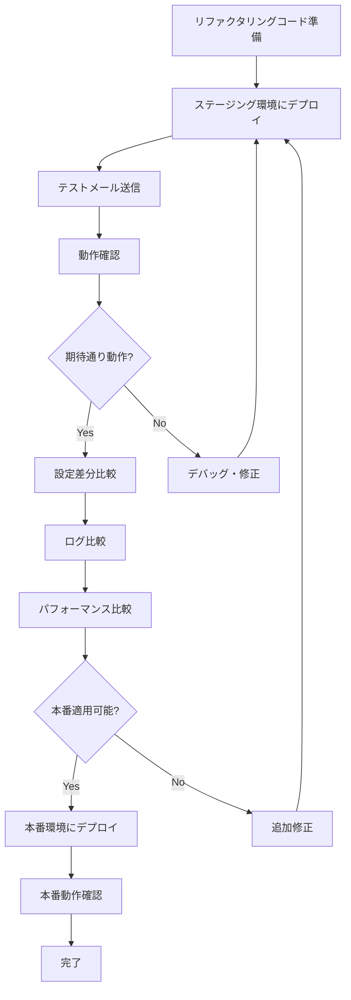

# Staging Environment Architecture

## 📋 レビュー修正完了 (2025-11-06)

本ドキュメントは以下のレビュー指摘に基づき修正済みです：

### ✅ 修正完了項目

1. **Docker Compose プロジェクト名分離**
   - `-p staging` によるネットワーク/ボリューム名の自動分離
   - `staging_mailserver_network`, `staging_postfix_spool` 等が自動生成
   - docker-compose.staging.yml のヘッダーに使用方法を明記

2. **Postfix Layer 1 防御の実装**
   - `default_transport = error:5.7.1 ...` を追加
   - `relay_transport = error:5.7.1 ...` を追加
   - 3層防御が完全に成立

3. **未作成設定ディレクトリの解消**
   - `config-staging/rspamd/` 作成
   - `config-staging/nginx/` 作成（nginx.conf + templates/）
   - `config-staging/clamav/` 作成（clamd.conf + freshclam.conf）
   - `config-staging/roundcube/` 作成（smtp_noauth.inc.php）

4. **`.env.staging` に使用例追記**
   - `-p staging` の使用方法を明示
   - 本番環境との同時稼働コマンド例を追加

5. **ポート競合の解消（内部ネットワーク化）**
   - ホスト側のポート公開を完全に削除
   - すべてのサービスは内部ネットワーク（172.21.0.0/24）でのみアクセス可能
   - Tailscale経由またはSSHトンネルでアクセス
   - セキュリティ向上（攻撃面の縮小）

## 概要

本番Mailserver環境（Dell + EC2）を壊さずにリファクタリング済みコードを検証するためのステージング環境の設計・実装ガイド。

## 目的

1. 本番のPostfix/Dovecot構成を参照してクローンを作成
2. TerraformとDockerのコードをstaging環境に対応
3. ステージング環境は「メール送信不可」「DB読み取り専用」に設定
4. リファクタリング済みコードの挙動を比較テスト

## アーキテクチャ図

```
┌─────────────────────────────────────────────────────────────────┐
│                         Dell Workstation                          │
│  ┌──────────────────────────────┐ ┌──────────────────────────┐  │
│  │   Production Environment      │ │  Staging Environment      │  │
│  │                               │ │                           │  │
│  │  Network: mailserver_network  │ │  Network: staging_*      │  │
│  │  Containers: mailserver-*    │ │  Containers: staging-*   │  │
│  │  Volumes: (no prefix)        │ │  Volumes: staging_*      │  │
│  │                               │ │                           │  │
│  │  ┌─────────────────────────┐ │ │  ┌────────────────────┐ │  │
│  │  │ Postfix (LMTP 2525)     │ │ │  │ Postfix (3525)     │ │  │
│  │  │ Dovecot (143,993,110...)│ │ │  │ Dovecot (3143...)  │ │  │
│  │  │ MariaDB (3306)          │ │ │  │ MariaDB (3307)     │ │  │
│  │  │ Roundcube (8080)        │ │ │  │ Roundcube (8081)   │ │  │
│  │  │ Rspamd (11334)          │ │ │  │ Rspamd (11335)     │ │  │
│  │  │ UserMgmt (5000)         │ │ │  │ UserMgmt (5001)    │ │  │
│  │  └─────────────────────────┘ │ │  └────────────────────┘ │  │
│  │                               │ │                           │  │
│  │  Tailscale: 100.110.222.53   │ │  Tailscale: Same host    │  │
│  │  Project: (default)          │ │  Project: staging (-p)   │  │
│  └──────────────────────────────┘ └──────────────────────────┘  │
└─────────────────────────────────────────────────────────────────┘
                         │                           │
                 Tailscale Mesh            Tailscale Mesh
                         │                           │
┌────────────────────────┴───────┐  ┌───────────────┴─────────────┐
│  AWS EC2 Production            │  │  AWS EC2 Staging             │
│  Instance: mailserver-mx-prod  │  │  Instance: mailserver-mx-stg │
│                                │  │                               │
│  Postfix (MX Gateway)          │  │  Postfix (MX Gateway)        │
│  Port 25 (SMTP)                │  │  Port 25 (SMTP)              │
│  relay_transport: lmtp:[       │  │  relay_transport: lmtp:[     │
│    100.110.222.53]:2525        │  │    100.110.222.53]:3525      │
│                                │  │                               │
│  Terraform workspace: prod     │  │  Terraform workspace: staging│
└────────────────────────────────┘  └──────────────────────────────┘
```

## ディレクトリ構造

```
project-root-infra/
├── docs/
│   └── infra/
│       └── staging/
│           ├── architecture.md          # 本ドキュメント
│           ├── setup-guide.md           # セットアップ手順
│           └── testing-guide.md         # テスト・検証手順
└── services/
    └── mailserver/
        ├── docker-compose.yml           # 本番環境
        ├── docker-compose.staging.yml   # ステージング環境（オーバーレイ）
        ├── .env                         # 本番環境変数
        ├── .env.staging                 # ステージング環境変数
        ├── config/                      # 本番設定ファイル
        │   ├── postfix/
        │   ├── dovecot/
        │   └── mariadb/
        ├── config-staging/              # ステージング設定ファイル
        │   ├── postfix/
        │   │   ├── main.cf
        │   │   └── master.cf
        │   ├── dovecot/
        │   │   ├── dovecot.conf
        │   │   └── dovecot-sql.conf.ext
        │   └── mariadb/
        │       └── readonly.cnf
        └── terraform/
            ├── main.tf
            ├── variables.tf
            ├── terraform.tfvars          # 本番変数
            └── staging.tfvars            # ステージング変数
```

## ネットワークアクセス方式

### 本番環境（ホスト公開）

| サービス | ホストポート | コンテナIP | 用途 |
|---------|-----------|----------|------|
| Postfix LMTP | 2525 | 172.20.0.20:2525 | LMTP from EC2 |
| Postfix Submission | 587 | 172.20.0.20:587 | User submission |
| Dovecot IMAPS | 993 | 172.20.0.30:993 | IMAPS |
| Dovecot POP3S | 995 | 172.20.0.30:995 | POP3S |
| Nginx HTTP | 80 | 172.20.0.10:80 | Webmail HTTP |
| Nginx HTTPS | 443 | 172.20.0.10:443 | Webmail HTTPS |

### Staging環境（LMTPのみ公開、他は内部ネットワーク）

| サービス | コンテナIP:ポート | ホスト公開 | アクセス方法 | 用途 |
|---------|-----------------|-----------|------------|------|
| **Postfix LMTP** | 172.21.0.20:2525 | **ホスト:3525** | **EC2 Staging から直接** | LMTP from EC2 staging |
| Postfix Submission | 172.21.0.20:587 | なし | SSH tunnel | User submission（無効化） |
| Dovecot IMAPS | 172.21.0.30:993 | なし | SSH tunnel: `ssh -L 3993:172.21.0.30:993 dell` | IMAPS |
| Dovecot POP3S | 172.21.0.30:995 | なし | SSH tunnel: `ssh -L 3995:172.21.0.30:995 dell` | POP3S |
| MariaDB | 172.21.0.60:3306 | なし | SSH tunnel: `ssh -L 3307:172.21.0.60:3306 dell` | Database（read-only） |
| Nginx HTTP | 172.21.0.10:80 | なし | SSH tunnel: `ssh -L 3080:172.21.0.10:80 dell` | Webmail HTTP |
| Nginx HTTPS | 172.21.0.10:443 | なし | SSH tunnel: `ssh -L 3443:172.21.0.10:443 dell` | Webmail HTTPS |

**アクセス方式:**
- 本番: ホストのポートを直接公開（0.0.0.0:PORT → コンテナ）
- Staging: LMTPのみホスト公開、他は内部ネットワークのみ
  - **EC2 Staging → Dell Staging**: Tailscale経由で `lmtp:[100.110.222.53]:3525` に直接接続
  - **外部クライアント → Dell Staging**: SSHトンネル経由でアクセス
  - **Dell ホスト → Staging コンテナ**: 内部IPで直接アクセス
  - **コンテナ内部操作**: `docker exec` で直接操作

**ポート公開の理由:**
- LMTP (3525:2525): EC2 Staging Postfix → Dell Staging Postfix のメール中継に必要
- その他のポート: 本番との競合回避のため非公開（内部ネットワークで完結）

**メリット:**
- ポート競合の完全回避（本番2525とstaging 3525が共存可能）
- セキュリティ向上（LMTPのみ公開、他は外部アクセス不可）
- EC2 Staging環境からのメール中継が可能

## リソース配分

### Dell Workstation (32GB RAM)

| 環境 | メモリ割当 | CPU割当 | 備考 |
|-----|-----------|---------|------|
| 本番環境 | 8-10GB | 4-6 cores | 現状維持 |
| ステージング環境 | 4-6GB | 2-3 cores | ClamAV無効 |
| システム | 2GB | - | OS予約 |
| 空き | 16GB以上 | - | バッファ |

**メモリ制限設定（docker-compose.staging.yml）:**
```yaml
services:
  postfix:
    deploy:
      resources:
        limits:
          memory: 512m
          cpus: '0.5'
  dovecot:
    deploy:
      resources:
        limits:
          memory: 1g
          cpus: '1.0'
  mariadb:
    deploy:
      resources:
        limits:
          memory: 1g
          cpus: '1.0'
```

## 環境分離戦略

### 1. Dell側分離

**Dockerネットワーク:**
- 本番: `mailserver_default`
- ステージング: `staging_mailserver_default`

**Dockerボリューム:**
- 本番: `mailserver_*`
- ステージング: `staging_*`

**コンテナ命名規則:**
- 本番: `mailserver-postfix`, `mailserver-dovecot`等
- ステージング: `staging-postfix`, `staging-dovecot`等

### 2. AWS/EC2側分離

**Terraform Workspace:**
```bash
# 本番
terraform workspace select prod

# ステージング
terraform workspace select staging
```

**リソース命名:**
- 本番: `mailserver-mx-prod`, `mailserver-prod-sg`
- ステージング: `mailserver-mx-stg`, `mailserver-stg-sg`

**インスタンスタイプ:**
- 本番: `t3.small`
- ステージング: `t3.micro`（コスト削減）

## セキュリティ設計

### 1. メール送信禁止（3層防御）

**Layer 1: Postfix transport設定（最強防御）**
```postfix
# config-staging/postfix/main.cf.tmpl
default_transport = error:5.7.1 External delivery is disabled in staging environment
relay_transport = error:5.7.1 External relay is disabled in staging environment
```
- すべての外部配送を明示的にerror応答で拒否
- relayhostより優先される最優先設定

**Layer 2: SASL認証無効化**
```postfix
# config-staging/postfix/main.cf.tmpl
relayhost = [127.0.0.1]:9999  # 無効なrelayhost
smtp_sasl_auth_enable = no     # SASL認証無効
```

**Layer 3: 無効なSASL認証情報**
```
# config-staging/postfix/sasl_passwd
[127.0.0.1]:9999 invalid_user:invalid_password
```

### 2. データベース読み取り専用（2層防御）

**Layer 1: MySQL設定**
```ini
# config-staging/mariadb/readonly.cnf
[mysqld]
read_only = 1
super_read_only = 1
```

**Layer 2: 専用ユーザー**
```sql
-- 本番MariaDBで作成
CREATE USER 'staging_readonly'@'%' IDENTIFIED BY 'SECURE_PASS';
GRANT SELECT ON mailserver_usermgmt.* TO 'staging_readonly'@'%';
FLUSH PRIVILEGES;
```

### 3. 本番環境への影響防止

**リソース制限:**
- Docker memory/CPU limits適用
- ClamAV無効（メモリ節約）
- Rspamd最小設定

**ボリューム分離:**
```bash
# バリデーションスクリプト
STAGING_VOLUMES=$(docker volume ls -q | grep staging)
PROD_VOLUMES=$(docker volume ls -q | grep mailserver)
OVERLAP=$(comm -12 <(echo "$STAGING_VOLUMES" | sort) <(echo "$PROD_VOLUMES" | sort))
if [ -n "$OVERLAP" ]; then
  echo "ERROR: Volume overlap detected!"
  exit 1
fi
```

**Terraform Workspace分離:**
```hcl
# Workspaceチェック
locals {
  prevent_prod_changes = terraform.workspace == "staging" ? 1 : 0
}
```

## データ管理戦略

### オプション1: 本番スナップショット（推奨）

```bash
# 本番DBのスナップショット取得
docker exec mailserver-mariadb mysqldump \
  --all-databases \
  --single-transaction \
  --routines \
  --triggers \
  > /tmp/prod-snapshot-$(date +%Y%m%d).sql

# ステージングDBに復元
docker exec -i staging-mariadb mysql < /tmp/prod-snapshot-$(date +%Y%m%d).sql

# 読み取り専用モード有効化
docker exec staging-mariadb mysql -e "SET GLOBAL read_only = ON; SET GLOBAL super_read_only = ON;"
```

### オプション2: 本番DBへの読み取り専用接続

```yaml
# docker-compose.staging.yml
services:
  dovecot:
    environment:
      - DB_HOST=172.18.0.60  # 本番MariaDBコンテナIP
      - DB_USER=staging_readonly
      - DB_PASSWORD=${STAGING_READONLY_PASSWORD}
```

**メリット・デメリット:**

| 方法 | メリット | デメリット |
|-----|---------|-----------|
| スナップショット | 完全分離、本番影響なし | データ更新が必要 |
| 読み取り専用接続 | リアルタイムデータ | 本番DB負荷増加 |

**推奨:** スナップショット方式（完全分離）

## 設定ファイルの差分

### Postfix (config-staging/postfix/main.cf)

**本番との主な差分:**
```diff
# 送信メール完全禁止
+ default_transport = error:5.7.1 Outbound mail disabled in staging
+ relay_transport = error:5.7.1 Outbound relay disabled in staging

# ホスト名
- myhostname = mail.kuma8088.com
+ myhostname = staging-mail.internal.example.com

# ドメイン
- mydomain = kuma8088.com
+ mydomain = staging.internal.example.com

# LMTPポート
- inet_interfaces = all
+ inet_interfaces = all
  (ポートマッピングで3525に変更)
```

### Dovecot (config-staging/dovecot/dovecot.conf)

**本番との主な差分:**
```diff
# ホスト名
- hostname = mail.kuma8088.com
+ hostname = staging-mail.internal.example.com

# データベース接続
- connect = host=172.18.0.60 dbname=mailserver_usermgmt
+ connect = host=staging-mariadb dbname=staging_mailserver

# 読み取り専用プラグイン
+ mail_plugins = $mail_plugins readonly
```

### MariaDB (config-staging/mariadb/readonly.cnf)

**ステージング専用設定:**
```ini
[mysqld]
# 読み取り専用モード強制
read_only = 1
super_read_only = 1

# バイナリログ無効（レプリケーション不要）
skip-log-bin

# リソース削減
max_connections = 50
innodb_buffer_pool_size = 512M
```

## リファクタリング検証フロー



**詳細手順:**

1. **ステージングデプロイ**
   ```bash
   cp refactored-main.cf config-staging/postfix/main.cf
   docker restart staging-postfix
   ```

2. **テスト実行**
   ```bash
   # EC2 staging → Dell staging
   echo "Test" | mail -s "Refactor Test" test@staging.example.com
   ```

3. **動作確認**
   ```bash
   docker logs staging-postfix --tail 50
   docker exec staging-dovecot doveadm mailbox list -u test@staging.example.com
   ```

4. **比較分析**
   ```bash
   # 設定差分
   diff <(docker exec mailserver-postfix postconf -n) \
        <(docker exec staging-postfix postconf -n)

   # ログ差分
   diff <(docker logs mailserver-postfix --tail 100) \
        <(docker logs staging-postfix --tail 100)
   ```

5. **本番適用**
   ```bash
   # 検証OK → 本番へ
   cp config-staging/postfix/main.cf config/postfix/main.cf
   docker restart mailserver-postfix
   ```

## リスク評価とミティゲーション

| リスク | 確率 | 影響度 | 対策 |
|-------|------|--------|------|
| ポート競合 | 中 | 高 | 3xxx範囲使用、事前検証 |
| リソース枯渇 | 高 | 中 | メモリ制限、ClamAV無効 |
| 本番データ汚染 | 低 | 致命的 | ボリューム分離、読み取り専用DB |
| 誤本番変更 | 中 | 致命的 | Terraformワークスペース、Git hooks |
| ステージングが本番に影響 | 中 | 中 | リソース制限、Docker CPU quota |
| 設定ドリフト | 高 | 低 | 自動比較スクリプト、バージョン管理 |
| ステージングから外部送信 | 低 | 高 | Postfix拒否ルール、ファイアウォール |

## モニタリング

### リソース監視

```bash
# リソース使用状況モニタリングスクリプト
#!/bin/bash
# /opt/scripts/staging-resource-monitor.sh

while true; do
  echo "$(date) - Resource Usage:"
  docker stats --no-stream | grep -E '(staging|mailserver)'

  # メモリ使用率チェック
  MEM_USAGE=$(free | grep Mem | awk '{print int($3/$2 * 100)}')
  if [ $MEM_USAGE -gt 85 ]; then
    echo "WARNING: Memory usage is ${MEM_USAGE}%"
  fi

  sleep 300
done > /var/log/staging-resource-monitor.log
```

### 設定ドリフト検出

```bash
# 設定ドリフトチェックスクリプト
#!/bin/bash
# /opt/scripts/config-drift-check.sh

# Postfix設定比較
diff -u \
  <(docker exec mailserver-postfix postconf -n) \
  <(docker exec staging-postfix postconf -n) \
  > /tmp/postfix-drift.txt

# 差分がある場合にアラート
if [ -s /tmp/postfix-drift.txt ]; then
  echo "Configuration drift detected - review /tmp/postfix-drift.txt"
  # メール通知やSlack通知をここに追加
fi
```

## 運用手順

### 起動・停止

```bash
# ステージング環境起動（必ず -p staging でプロジェクト名分離）
cd /opt/onprem-infra-system/project-root-infra/services/mailserver
docker compose -p staging -f docker-compose.yml -f docker-compose.staging.yml \
  --env-file .env.staging up -d

# ステージング環境停止
docker compose -p staging -f docker-compose.yml -f docker-compose.staging.yml \
  --env-file .env.staging down

# ステージング環境削除（ボリューム含む）
docker compose -p staging -f docker-compose.yml -f docker-compose.staging.yml \
  --env-file .env.staging down -v
```

### Tailscale/SSH経由アクセス

Staging環境はホスト側にポートを公開していません。以下の方法でアクセスします。

**方法1: SSHトンネル（推奨）**

```bash
# IMAPSアクセス（ローカルポート3993 → staging Dovecot 993）
ssh -L 3993:172.21.0.30:993 user@dell-workstation.tail67811d.ts.net

# その後、メールクライアントで localhost:3993 に接続
```

**方法2: docker exec（デバッグ用）**

```bash
# Dovecotコンテナ内でdoveadm実行
docker exec mailserver-staging-dovecot doveadm user '*'

# MariaDBコンテナ内でmysql実行
docker exec -it mailserver-staging-mariadb mysql -u root -pStagingRoot2024!
```

**方法3: Dellホストから直接アクセス**

```bash
# Dellホスト上で内部IPに接続
mysql -h 172.21.0.60 -u root -pStagingRoot2024!

# または curl で Nginx にアクセス
curl http://172.21.0.10/
```

### データリフレッシュ

```bash
# 本番スナップショットからステージングDBを更新
cd /opt/onprem-infra-system/project-root-infra/services/mailserver

# 1. スナップショット取得
docker exec mailserver-mariadb mysqldump \
  --all-databases --single-transaction \
  > /tmp/prod-snapshot-$(date +%Y%m%d).sql

# 2. ステージングDB停止
docker compose -p staging -f docker-compose.yml -f docker-compose.staging.yml \
  --env-file .env.staging stop mariadb

# 3. ボリューム削除・再作成（プロジェクト名プレフィックス付き）
docker volume rm staging_db_data
docker volume create staging_db_data

# 4. MariaDB再起動
docker compose -p staging -f docker-compose.yml -f docker-compose.staging.yml \
  --env-file .env.staging start mariadb

# 5. データ復元
docker exec -i mailserver-staging-mariadb mysql < /tmp/prod-snapshot-$(date +%Y%m%d).sql

# 6. 読み取り専用モード有効化
docker exec mailserver-staging-mariadb mysql -e "SET GLOBAL read_only = ON; SET GLOBAL super_read_only = ON;"
```

## トラブルシューティング

### ポート競合

**症状:**
```
Error starting userland proxy: listen tcp 0.0.0.0:3525: bind: address already in use
```

**対処:**
```bash
# 使用中のポート確認
sudo netstat -tuln | grep 3525

# プロセス特定
sudo lsof -i :3525

# 必要に応じてプロセス停止またはポート変更
```

### メモリ不足

**症状:**
```
FATAL: Cannot allocate memory
```

**対処:**
```bash
# 現在のメモリ使用状況確認
free -h
docker stats --no-stream

# 不要なコンテナ停止
docker compose -p staging -f docker-compose.yml -f docker-compose.staging.yml stop clamav

# メモリ制限を厳格化
# docker-compose.staging.ymlのメモリ制限を調整
```

### 本番環境への影響

**症状:**
- 本番メールの遅延
- 本番コンテナのCPU使用率上昇

**対処:**
```bash
# ステージング環境の一時停止
docker compose -p staging -f docker-compose.yml -f docker-compose.staging.yml stop

# リソース制限の見直し
# docker-compose.staging.ymlのCPU制限を調整

# 再起動
docker compose -p staging -f docker-compose.yml -f docker-compose.staging.yml start
```

## 次のステップ

1. ✅ **アーキテクチャ設計完了** ← 現在
2. ⏳ **設定ファイル作成** ← 次
3. ⏳ **Dell環境構築**
4. ⏳ **AWS環境構築**
5. ⏳ **検証テスト実行**

詳細な手順は以下のドキュメントを参照：
- [setup-guide.md](./setup-guide.md) - セットアップ手順
- [testing-guide.md](./testing-guide.md) - テスト・検証手順

## 参考資料

- [Mailserver README](../../application/mailserver/README.md)
- [Docker Compose Documentation](https://docs.docker.com/compose/)
- [Terraform Workspaces](https://www.terraform.io/docs/language/state/workspaces.html)
- [Postfix Configuration](http://www.postfix.org/postconf.5.html)
- [Dovecot Configuration](https://doc.dovecot.org/)
